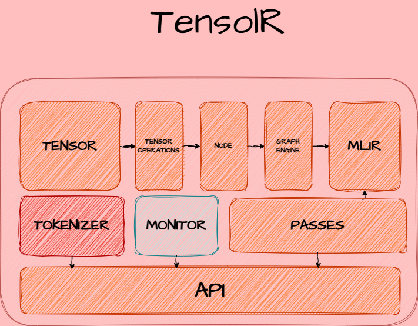

# Tensolr

Tensolr is a TensorFlow-like tensor framework with automatic differentiation, computation graphs, and planned MLIR integration. It's designed for educational purposes and for those interested in understanding how deep learning frameworks work under the hood.

## Architecture



## Table of Contents
- [Features](#features)
- [Installation](#installation)
- [API Documentation](#api-documentation)
  - [Tensolr Tensor](#tensolr-tensor)
  - [Neural Network API](#neural-network-api)
  - [Optimizers](#optimizers)
- [Usage Examples](#usage-examples)
- [Testing](#testing)
- [Project Structure](#project-structure)
- [Contributing](#contributing)
- [License](#license)

## Features

- Tensor operations (add, subtract, multiply, divide, matrix multiplication, transpose)
- Automatic differentiation with computation graphs
- Neural network layers and activation functions
- Optimizers (SGD, Adam, RMSprop)
- MLIR emission capabilities
- Optimization passes (DCE, Fusion)
- CPU and GPU runners (with GPU support via cupy)
- Comprehensive test suite with pytest

## Installation

```bash
# Clone the repository
git clone <repository-url>
cd tensolr

# Create virtual environment (recommended)
python -m venv venv
source venv/bin/activate  # On Windows: venv\Scripts\activate

# Install dependencies
pip install -r requirements.txt

# For GPU support (optional)
pip install cupy-cuda11x  # or cupy-cuda12x depending on your CUDA version
```

## API Documentation

### Tensolr Tensor

The core tensor class that supports various mathematical operations and automatic differentiation.

#### Creating Tensors
```python
from src.tensor import Tensolr

# From Python lists
a = Tensolr([[1, 2], [3, 4]])

# Using factory methods
zeros_tensor = Tensolr.zeros((3, 3))
ones_tensor = Tensolr.ones((2, 4))
random_tensor = Tensolr.randn((2, 3))  # Random normal distribution
```

#### Properties
- `.shape` - Shape of the tensor
- `.size` - Total number of elements
- `.ndim` - Number of dimensions
- `.dtype` - Data type

#### Operations
- `.add(other)` - Element-wise addition
- `.sub(other)` - Element-wise subtraction
- `.mul(other)` - Element-wise multiplication
- `.div(other)` - Element-wise division
- `.pow(other)` - Element-wise power
- `.matmul(other)` - Matrix multiplication
- `.transpose()` - Matrix transpose

### Neural Network API

Located in `src/api/nn.py`, contains building blocks for neural networks.

#### Layers
- `Linear(in_features, out_features, bias=True)` - Fully connected layer
- `Sequential(*modules)` - Sequential container

#### Activation Functions
- `ReLU()` - Rectified Linear Unit
- `Sigmoid()` - Sigmoid activation
- `Tanh()` - Hyperbolic tangent

#### Loss Functions
- `MSE()` - Mean Squared Error loss

### Optimizers

Located in `src/api/optim.py`, contains various optimization algorithms.

- `SGD(parameters, lr=0.01, momentum=0.0)` - Stochastic Gradient Descent
- `Adam(parameters, lr=0.001, betas=(0.9, 0.999))` - Adam optimizer
- `RMSprop(parameters, lr=0.001, alpha=0.99)` - RMSprop optimizer

## Usage Examples

### Basic Tensor Operations

```python
from src.tensor import Tensolr

# Create tensors
a = Tensolr([[1, 2], [3, 4]])
b = Tensolr([[5, 6], [7, 8]])

# Perform operations
c = a.add(b)  # Addition
d = a.matmul(b)  # Matrix multiplication
e = a.transpose()  # Transpose

print(f"Shape of A: {a.shape}")
print(f"A + B:\n{c.data}")
print(f"A @ B:\n{d.data}")
print(f"A^T:\n{e.data}")
```

### Simple Neural Network

```python
from src.tensor import Tensolr
from src.api.nn import Linear, ReLU, Sequential, MSE
from src.api.optim import SGD

# Define a model
model = Sequential(
    Linear(10, 5),
    ReLU(),
    Linear(5, 1)
)

# Create some dummy data
X = Tensolr([[1, 2, 3, 4, 5, 6, 7, 8, 9, 10]])
y_true = Tensolr([[0.5]])

# Forward pass
y_pred = model(X)

# Compute loss
loss_fn = MSE()
loss = loss_fn(y_pred, y_true)

print(f"Prediction: {y_pred.data}")
print(f"Loss: {loss.data}")
```

### Training Loop

```python
from src.tensor import Tensolr
from src.api.nn import Linear, MSE
from src.api.optim import SGD

# Create data
X = Tensolr([[1.0, 2.0], [3.0, 4.0], [5.0, 6.0]])
y_true = Tensolr([[1.0], [0.0], [1.0]])

# Define model
model = Linear(2, 1)
loss_fn = MSE()
optimizer = SGD(model.parameters(), lr=0.01)

# Training loop
for epoch in range(100):
    # Forward pass
    y_pred = model(X)
    
    # Compute loss
    loss = loss_fn(y_pred, y_true)
    
    # Zero gradients
    optimizer.zero_grad()
    
    # Backward pass
    from src.global_graph import GLOBAL_GRAPH
    GLOBAL_GRAPH.nodes = []  # Clear previous graph
    
    # Add nodes to the computation graph
    for param in model.parameters():
        GLOBAL_GRAPH.add_node(param.tensor._node)
    GLOBAL_GRAPH.add_node(X._node)
    GLOBAL_GRAPH.add_node(y_true._node)
    GLOBAL_GRAPH.add_node(y_pred._node)
    GLOBAL_GRAPH.add_node(loss._node)
    
    # Compute gradients
    GLOBAL_GRAPH.backward()
    
    # Update parameters
    optimizer.step()
    
    if epoch % 20 == 0:
        print(f"Epoch {epoch}, Loss: {loss.data}")
```

## Testing

### Running Tests

The project uses pytest for testing. To run all tests:

```bash
# Run all tests
python -m pytest tests/

# Run tests with verbose output
python -m pytest tests/ -v

# Run specific test file
python -m pytest tests/test_tensolr.py

# Run tests with coverage
python -m pytest tests/ --cov=src/
```

### Test Structure

Tests are located in the `tests/` directory and cover:

- Basic tensor operations (addition, subtraction, multiplication, etc.)
- Graph computation and backpropagation
- Neural network API functionality
- Optimizer functionality
- Factory functions

## Project Structure

```
tensolr/
├── src/                    # Source code
│   ├── tensor.py           # Core tensor implementation
│   ├── graph.py            # Computation graph
│   ├── global_graph.py     # Global graph instance
│   ├── node.py             # Graph node representation
│   ├── api/                # High-level API
│   │   ├── __init__.py
│   │   ├── nn.py           # Neural network layers
│   │   └── optim.py        # Optimizers
│   ├── passes/             # Optimization passes
│   │   ├── __init__.py
│   │   ├── dce.py          # Dead code elimination
│   │   └── fusion.py       # Operator fusion
│   ├── runners/            # CPU/GPU execution
│   │   ├── __init__.py
│   │   ├── cpu_runner.py
│   │   └── gpu_runner.py
│   └── mlir_emitter.py     # MLIR code generation
├── examples/               # Usage examples
│   ├── hello_tensor.py                 # Basic tensor operations example
│   ├── train_minimodel.py              # Neural network training example
│   ├── mlir_optimization_example.py    # MLIR emission and optimization example
│   ├── complex_nn_example.py           # Complex neural network example
│   ├── optimizer_comparison_example.py # Optimizer comparison example
│   ├── tensor_operations_example.py    # Tensor operations with different shapes/types
│   └── computation_graph_example.py    # Computation graphs and autodiff example
├── tests/                  # Test suite
│   └── test_tensolr.py     # Comprehensive tests
├── requirements.txt        # Python dependencies
├── pyproject.toml          # Project metadata and build configuration
├── setup.py                # Setup configuration
└── README.md               # This file
```

## Examples

Check out the examples in the `examples/` directory:

### Basic Examples
- `hello_tensor.py`: Basic tensor operations
- `tensor_operations_example.py`: Various tensor operations with different shapes and data types
- `computation_graph_example.py`: Computation graphs and automatic differentiation

### Neural Network Examples
- `train_minimodel.py`: Simple neural network training
- `complex_nn_example.py`: Complex neural network architectures (Multi-layer perceptron for XOR problem)
- `optimizer_comparison_example.py`: Comparing different optimizers (SGD, Adam, RMSprop)

### Advanced Examples
- `mlir_optimization_example.py`: MLIR emission and optimization passes (DCE, Fusion)

### Running Examples

You can run examples in two ways:

**Method 1: Using the run_examples.py script (recommended)**
```bash
# List all available examples
python run_examples.py list

# Run a specific example
python run_examples.py hello_tensor
python run_examples.py train_minimodel
python run_examples.py complex_nn_example
```

**Method 2: Running directly from the project root**
```bash
python examples/hello_tensor.py
python examples/train_minimodel.py
python examples/complex_nn_example.py
```

## Contributing

1. Fork the repository
2. Create a feature branch (`git checkout -b feature/amazing-feature`)
3. Make your changes
4. Add tests for your changes
5. Ensure all tests pass (`python -m pytest tests/`)
6. Commit your changes (`git commit -m 'Add some amazing feature'`)
7. Push to the branch (`git push origin feature/amazing-feature`)
8. Open a Pull Request

## License

MIT License - see the [LICENSE](LICENSE) file for details.
